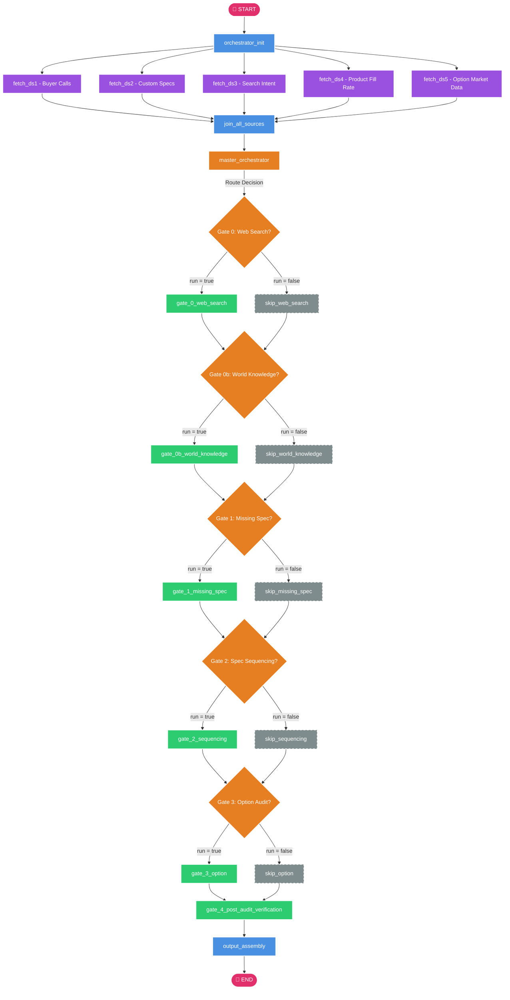
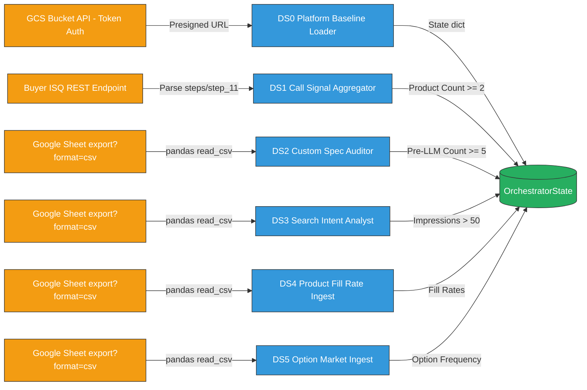
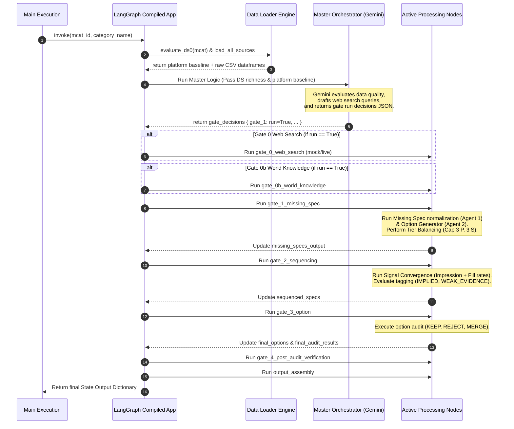

# 🎛️ Master Correction Agent for Seller Specs (M-CASS)
### *Enterprise Multi-Agent LangGraph Pipeline for Autonomous B2B Catalog Spec Normalization & Signal Convergence*

[](https://www.python.org/)
[](https://github.com/langchain-ai/langgraph)
[](https://streamlit.io/)
[](https://github.com/)

---

## 🎯 Executive Overview & System Constitution

In large-scale B2B marketplaces (particularly in the Indian industrial, agricultural, chemical, and textile landscapes), seller-submitted specifications are notoriously chaotic, noisy, and non-standardized. Dynamic market shifts, linguistic variations, localized trade abbreviations (such as **"GI"** for Galvanized Iron, or **"MS"** for Mild Steel), and inconsistent search queries prevent structured filtering and product discovery.

**M-CASS (Master Correction Agent for Seller Specs)** is an autonomous, industrial-grade multi-agent pipeline powered by **LangGraph** and **Gemini 2.5 Pro**. It ingests **six distinct multi-source data streams (DS0 to DS5)**, processes them through concurrent retrieval workers, evaluates gaps against catalog baselines using a strict **4-Step B2B Spec Auditing Constitution**, and produces standardized, sequenced, and tier-balanced B2B attributes.

### 🏛️ The System Constitution & Philosophy

The entire pipeline is governed by a strict set of fundamental rules ("The Catalog Health Constitution"):

1. **The Conservative Inclusion Rule (Golden Rule)**: *When in doubt, REJECT.* A false "new" spec corrupts the catalog; a false "covered" spec is safe and recoverable. Standard specifications must survive aggressive semantic, example value, bidirectional composite/component, and category-relevance checks before being admitted.
2. **Signal-to-Noise Ratio Preservation**: Candidate specs from seller custom pools (DS2) require a **frequency count >= 5** to protect the master catalog from one-off seller spelling variants.
3. **Strict Title Case & Clean Formatting**: All final specification names must follow Title Case, contain absolutely no ALL CAPS (e.g. standardizing `BRAND` to `Brand`), and be stripped of trailing punctuations (`.`, `:`, `-`).
4. **Local Trade Terminology Preference**: Value formatting prioritizes local Indian B2B standards (e.g. `GI` for Galvanized Iron, `MS` for Mild Steel, `GSM` for fabric weights, `ISI` for certified goods) while standardizing units to SI conventions (`kg`, `mm`, `V`, `W`, `A`, `rpm`, `Hz`, `L`).
5. **Dynamic Tier Allocation & Balance**: Audited specifications are allocated into three tiers (**Primary, Secondary, Tertiary**). A hard catalog limit is enforced: **Max 3 Primary, Max 3 Secondary**, and all remaining attributes overflow into Tertiary. Discovered candidate specs are strictly Tertiary by default to maintain baseline stability.

---

## 🏗️ Architectural Topology & Control Flow

### High-Level System Map (ASCII)
```text
                       [START]
                          │
                  ┌───────┴───────┐
                  ▼               ▼
           [orchestrator_init]    [evaluate_ds0] 
                  │               (GCS JSON Baseline)
                  ▼
         ┌────────────────────────────────────────────────────────┐
         │  Phase 1 Parallel Data Fetching & Extraction Workers  │
         │  ┌───────────┬───────────┬───────────┬──────────────┐  │
         │  ▼           ▼           ▼           ▼              ▼  │  │
         │[fetch_ds1] [fetch_ds2] [fetch_ds3] [fetch_ds4] [fetch_ds5]│
         │  (Calls)    (Customs)   (Search)   (FillRates) (OptFills) │
         └──┬───────────┬───────────┬───────────┬──────────────┬──┘
            │           │           │           │              │
            ▼           ▼           ▼           ▼              ▼
         ┌────────────────────────────────────────────────────────┐
         │                 [join_all_sources]                     │
         └────────────────────────┬───────────────────────────────┘
                                  │
                                  ▼
                       [master_orchestrator] 
                   (Gemini 2.5 Pro Decision Brain)
                                  │
         ┌────────────────────────┴────────────────────────┐
         │            Conditional Routing Gates            │
         ├────────────────────────┬────────────────────────┤
         │ Gate 0: Web Search     ├─► [gate_0_web_search]  │
         │ Gate 0b: World Knowl.  ├─► [gate_0b_world_know] │
         │ Gate 1: Missing Spec   ├─► [gate_1_missing]     │
         │ Gate 2: Sequencing     ├─► [gate_2_sequencing]  │
         │ Gate 3: Option Audit   ├─► [gate_3_option]      │
         └────────────────────────┬────────────────────────┘
                                  │
                                  ▼
                  [gate_4_post_audit_verification]
                                  │
                                  ▼
                          [output_assembly]
                                  │
                                  ▼
                                [END]
```

### End-to-End Control Flow Diagram
The following Mermaid flowchart represents the complete control path of the LangGraph runtime, illustrating every node transition, conditional routing mechanism, and fallback path:



### Internal Data & Caching Pipeline
The diagram below demonstrates how data flows dynamically from remote endpoints (GCS buckets, REST APIs, Google Spreadsheets) through pandas cleaning routines, converging in high-fidelity memory registers before execution:



---

## ⚙️ Under-The-Hood Mechanics (Code-Level Specs)

### 1. Unified State Schema (`OrchestratorState`)
The state is managed in LangGraph as a python `TypedDict` using state reducers (`operator.ior` for concurrent map updates and `operator.add` for list merges) to facilitate clean parallel execution paths:

```python
from typing import TypedDict, Annotated, List, Dict, Any
import operator

class OrchestratorState(TypedDict):
    mcat_id: str
    category_name: str
    
    # Store outputs of Phase 1 Parallel fetch
    ds0_status: str
    ds1_status: str
    ds2_status: str
    ds3_status: str
    ds4_status: str
    ds5_status: str
    
    ds0_data: List[Dict]
    ds1_data: List[Dict]
    ds2_data: List[Dict]
    ds3_data: List[Dict]
    ds4_data: List[Dict]
    ds5_data: List[Dict]
    
    # Store AI analysis from individual DS agents
    ds1_agent_output: Dict[str, Any]
    ds2_agent_output: Dict[str, Any]
    ds3_agent_output: Dict[str, Any]
    
    # Availability Map with Reducer to allow concurrent updates from parallel fetchers
    availability_map: Annotated[Dict[str, str], operator.ior]
    
    # Trace for final audit
    final_audit_results: List[Dict]
    
    # Track the pipeline thought stream linearly
    thought_stream: Annotated[List[str], operator.add]
    
    # Web search and world knowledge results
    web_search_result: Dict[str, Any]
    world_knowledge_result: Dict[str, Any]
    
    # Agent outputs
    missing_specs_output: Dict[str, Any]
    sequenced_specs: Dict[str, Any]
    final_options: Dict[str, Any]
    
    # Master Orchestrator Fields
    gate_decisions: Dict[str, Any]
    master_wk_tasks: List[str]
    master_ws_queries: List[str]
    master_overrides: List[str]
    master_anomalies: List[str]
    master_confidence: str
    master_raw_response: str
    master_reasoning: str
    
    final_output: Dict[str, Any]
```

### 2. Regular Expressions & Scraping Patterns
The pipeline utilizes three critical regular expressions to parse, protect, and clean API and JSON string layers:

1. **Stream Control Character Strip Regex**:
   `re.compile(r'[\x00-\x1F\x7F]')`
   *Purpose*: This pattern removes non-printable ASCII control characters (0-31 and 127) from the model's output before printing, avoiding the infamous Windows socket write errors `[Errno 22] Invalid argument` in Streamlit console buffers while maintaining complete multi-lingual support (Hindi, Marathi, etc.) and emojis.
2. **GCS Gstorage Storage Matcher**:
   `re.search(r'https://storage\.googleapis\.com/[^\s"\']+', json_str)`
   *Purpose*: Used inside `evaluate_ds0` when the GCS pre-signed redirect bucket API does not directly expose a URL field. It extracts the raw Google Cloud Storage bucket download URL embedded in any flat string response blocks.
3. **Markdown JSON Codefence Cleanup**:
   `aiResponse.replace(/```json/gi, '').replace(/```/g, '').trim()`
   *Purpose*: Employed in the n8n JavaScript node scripts to scrub markdown wrapping from LLM raw blocks prior to JSON parsing, preventing crashing in parsing steps.

---

## ⚖️ Core Validation Rules (The 4-Step B2B Constitution)

```
                              ┌────────────────────────┐
                              │  CANDIDATE BUYER SPEC  │
                              └───────────┬────────────┘
                                          ▼
   STEP 1: Semantic Match Check ─────────►[Synonym Matches?]────────► REJECT (synonym of platform)
                                          │ No
                                          ▼
   STEP 2: Value Coverage Check ─────────►[80%+ Platform Covered?]──► REJECT (values covered)
                                          │ No
                                          ▼
   STEP 3: Composite/Component Check ────►[Bidirectional Overlap?]──► REJECT (derivable or component)
                                          │ No
                                          ▼
   STEP 4: Relevance & Implied Check ────►[Category Implied?]──────► REJECT (e.g. Fan Type for Fans)
                                          │ No
                                          ▼
                               ┌────────────────────────┐
                               │  ACCEPT INTO CATALOG   │
                               └────────────────────────┘
```

Inside **Gate 1 (Missing Spec)** and **DS1/DS2/DS3 Agents**, standard specifications are passed through a multi-stage validation engine designed to minimize false duplicates:

### Step 1: Semantic Match Check (Meaning > Name)
If an existing platform specification captures the exact same physical or functional property, the candidate is **REJECTED**. Synonyms are aggressively checked using generic and domain-specific maps:
* **Generic Maps**: `Application` = `Usage` = `End Use` = `Use Case` = `Purpose`; `Finish` = `Surface Finish` = `Coating` = `Plating` = `Polish`; `Capacity` = `Volume` = `Tank Size` = `Storage Capacity`.
* **Spices Domain**: `Heat Level` = `Spiciness` = `SHU` = `Scoville Heat Units` = `Capsaicin Content`.
* **Metals Domain**: `Grade` = `IS Grade` = `ASTM Grade` = `Material Grade`; `Thickness` = `Gauge` = `Wall Thickness`.
* **Machinery Domain**: `Flow Rate` = `Discharge` = `Pump Capacity` = `LPH` = `GPM`; `Power` = `HP` = `Horsepower` = `KW`.

### Step 2: Example Value Coverage Check (80% Rule)
If $\ge 80\%$ of the candidate specification's values can be standardly answered or mapped under an existing platform specification, it is **REJECTED** as a duplicate.
* *Example*: Buyer spec `Wire Gauge` with values `["18 AWG", "20 AWG", "22 AWG"]` maps cleanly to existing platform spec `Gauge`. Rejected.

### Step 3: Composite & Component Check (Bidirectional Rule)
* **Direction A (Composite)**: If the candidate spec is a composite of existing attributes, it is **REJECTED**. E.g., Candidate `Size: 10x20x5mm` is rejected because the catalog already has discrete columns `Length`, `Width`, and `Height`.
* **Direction B (Component)**: If the candidate spec is a singular component of an existing composite, it is **REJECTED**. E.g., Candidate `Diameter` is rejected because the catalog has `Dimensions (OD x ID x L)`.

### Step 4: Category Relevance & Category-Implied Check
* **Irrelevant**: Specs belonging to adjacent attachments or accessory structures are filtered out (e.g., `Engine Type` for category `Office Chair`).
* **Category-Implied**: Attributes built directly into the category name are **REJECTED** as they add no filter value (e.g., `Solar Inverter` -> Reject `Inverter Type`; `LED Bulb` -> Reject `Bulb Type`).

---

## 📊 Ingested Data Sources & Asset Schemas

The pipeline maps and integrates **six dynamic datasets** during Phase 1:

| Source | Data Domain | Endpoint/API URL | Pre-Processing & Quality Thresholds |
| :--- | :--- | :--- | :--- |
| **DS0** | Platform Catalog Baseline | `https://get-presigned-url-for-mcat-w2yrp7i6za-el.a.run.app/` | API returns dynamic GCS pre-signed JSON. Collects existing spec names and limits standard options to top 6. |
| **DS1** | Buyer-Seller Call Audits | `https://get-buyer-isq-details-w2yrp7i6za-el.a.run.app/` | Fetches caller cumulative count CSV. Aggregates count per value; drops options with count < 2; limits to top 10 options. |
| **DS2** | Seller Custom Spec Entries | `https://docs.google.com/spreadsheets/d/1kApKRPgaVH0...` | Google Sheet CSV. Aggregates duplicate inputs. **Strict threshold applied**: Entries must appear $\ge 5$ times. JSON specs bypass. |
| **DS3** | Buyer Search Intent | `https://docs.google.com/spreadsheets/d/1krL9KbJOjBp...` | Google Sheet CSV. Groups query terms. Compiles total search impressions per spec. **Status threshold**: Rich if sum > 50. |
| **DS4** | Product Spec Fill Rate | `https://docs.google.com/spreadsheets/d/1JF7Hh7DDCx9...` | Google Sheet CSV. Tracks real catalog completeness percentages across active market listings. |
| **DS5** | Option Market Fill Rate | `https://docs.google.com/spreadsheets/d/1bTB2AXhoydP...` | Google Sheet CSV. Option frequency mapping used to identify standard trade options and purge outlier inputs. |

---

## 🔄 The System Lifecycle: A Tour of a Multi-Turn Trace

When a request is submitted, M-CASS undergoes a strict, sequential, multi-turn state transformation:



### Trace Step Details:
1. **Turn 1: Initialization (`orchestrator_init`)**: Resolves the target category parameters. The system requests DS0 GCS API using custom authorization token header `{"Token": "adr-wsbu-ocm"}`. Evaluates current platform schema.
2. **Turn 2: Concurrent Signal Ingestion**: Dispatches async requests to fetch search impressions (DS3), custom specs (DS2), calls (DS1), and fill rates. Groups, filters, and standardizes options locally.
3. **Turn 3: Master Orchestration Decision**: Passes a summarized, structural view of the raw signal statuses to the Master Orchestrator Node. Gemini Pro parses the signals, registers anomalies, overrides gaps, and publishes a `gate_decisions` map controlling the workflow routes.
4. **Turn 4: Gap Detection & Normalization (Gate 1)**: Unified candidates are matched against platform parameters. Normalizes names, expands abbreviations, removes trailing punctuation, generates standard options, and applies tier-balancing policies.
5. **Turn 5: Signal Convergence & Ranking (Gate 2)**: Standardized specifications are evaluated using dynamic signals: $\text{Rank Score} = \text{Fill Rate} + \text{Search Impressions} + \text{Call Product Count}$. Categorizes attributes using system sanity tags (`IMPLIED`, `DATA_ARTIFACT`, `WEAK_EVIDENCE`).
6. **Turn 6: Option Audit & Purification (Gate 3)**: Audits standard option lists. Purges vague filler options (e.g. `Other`, `As per requirement`, `Custom`) and standardizes values (`12V` instead of `12 Volt`).
7. **Turn 7: Assembly & Verification (Gate 4 & Output)**: Translates final arrays, checks integrity against base structures, and mounts a side-by-side comparative analysis payload.

---

## 📈 Value Benchmark: Before vs. After Processing

Below is an authentic illustration showing the value output of the system—converting sparse, messy, non-standard seller inputs into pristine, structured B2B catalog structures:

### Raw, Un-audited Input State (Messy Seller Specs)
```json
[
  {
    "spec_name": "MOL WEIGHT",
    "option_value": "98.08 g/mol",
    "source": "custom_specs_flat"
  },
  {
    "spec_name": "formula",
    "option_value": "H2SO4",
    "source": "custom_specs_flat"
  },
  {
    "spec_name": "Assay (HPLC):",
    "option_value": "98 Min",
    "source": "custom_specs_flat"
  },
  {
    "spec_name": "packing size.",
    "option_value": "50Ltr",
    "source": "custom_specs_flat"
  },
  {
    "spec_name": "BRAND",
    "option_value": "BASF",
    "source": "custom_specs_flat"
  }
]
```

### Audited, Cleaned, and Standardized Output State (M-CASS Output)
```json
{
  "category_name": "Industrial Acids",
  "mcat_id": "191595",
  "finalized_specs": {
    "finalized_primary_specs": {
      "specs": [
        {
          "spec_name": "Brand",
          "options": ["BASF", "TATA Chemicals", "Gujarat Alkalies"],
          "input_type": "radio_button",
          "tier": "Primary"
        }
      ]
    },
    "finalized_secondary_specs": {
      "specs": [
        {
          "spec_name": "Chemical Formula",
          "options": ["H2SO4", "HCl", "HNO3"],
          "input_type": "radio_button",
          "tier": "Secondary"
        },
        {
          "spec_name": "Assay (HPLC)",
          "options": ["98%", "99%", "95%"],
          "input_type": "radio_button",
          "tier": "Secondary"
        }
      ]
    },
    "finalized_tertiary_specs": {
      "specs": [
        {
          "spec_name": "Molecular Weight",
          "options": ["98.08 g/mol", "36.46 g/mol", "63.01 g/mol"],
          "input_type": "radio_button",
          "tier": "Tertiary"
        },
        {
          "spec_name": "Packaging Size",
          "options": ["50 L", "200 L", "1000 L"],
          "input_type": "radio_button",
          "tier": "Tertiary"
        }
      ]
    }
  }
}
```

---

## 📁 Repository Directory & Module Mapping

```text
c:\Users\Imart\Desktop\Multi-Agent-2\
│
├── .gitignore                      ◄— Standard python patterns (ignores cache/venv; tracks data/json)
├── requirements.txt                ◄— Core requirements (LangGraph, Streamlit, Pandas, Google API)
├── requirements_dashboard.txt      ◄— Optional custom dependencies for web dashboard
├── README.md                       ◄— This masterclass technical documentation file
│
├── orchestrator/                   ◄— Core Pipeline Namespace
│   ├── __init__.py                 ◄— Package marker
│   ├── main.py                     ◄— CLI entrypoint; executes compiled LangGraph workflow
│   ├── state.py                    ◄— TypedDict schema definition & state reducers
│   ├── graph_builder.py            ◄— LangGraph network layout & conditional routers
│   ├── nodes.py                    ◄— Multi-stage worker nodes & AI normalization agents
│   ├── master_orchestrator_node.py ◄— Dynamic Gemini reasoning engine & routing arbiter
│   ├── prompts.py                  ◄— Enterprise B2B multi-agent system prompt registry (100KB+)
│   ├── llm_client.py               ◄— Standardized Gemini Gateway wrapper with custom extracts
│   ├── data_loader.py              ◄— Multi-source fetching module (DS0-DS5 CSV/REST endpoints)
│   ├── skip_nodes.py               ◄— Safe passthrough bypass handlers for conditional routing
│   └── dashboard.py                ◄— Professional Streamlit interactive user interface
│
├── Blueprints / JSON Flows/        ◄— n8n Server Integrations (For Reference/n8n imports)
│   ├── Buyer Search Specs - Linear Flow.json
│   ├── Buyer Seller Call Missing Spec Checker.json
│   ├── Custom Spec Workflow copy.json
│   ├── Missing Spec Optimizer - Complete Flow v2.json
│   ├── Option Audit Agent v1.json
│   └── Spec Sequencing Agent Final.json
│
└── Parsed Blueprint Manuals/      ◄— Extracted flow documentation for reference
    ├── blueprint_analysis.md
    ├── missing_spec_blueprint.md
    ├── option_blueprint.md
    └── sequencing_blueprint.md
```

---

## 🚀 Step-by-Step Installation & Execution Guide

### 1. Prerequisites
Ensure you have Python 3.10 or 3.11 installed. Avoid Python 3.12+ for maximum stability with certain legacy database adapters.

### 2. Environment Configuration
Create a `.env` file in the root directory (or inject it directly into your OS shell variables). M-CASS uses the environment variable `LLM_GATEWAY_API_KEY` to authenticate with Google Gemini Gateway servers:

```bash
# In your terminal
export LLM_GATEWAY_API_KEY="sk-1V_j4KY8sPIELOSTD23UbQ"
```

### 3. Setting Up a Virtual Environment (Highly Recommended)
Configure a local sandboxed environment to isolate dependency conflicts:

```bash
# Navigate to the project root
cd c:\Users\Imart\Desktop\Multi-Agent-2

# Initialize the environment
python -m venv venv

# Activate the environment
# For Windows:
.\venv\Scripts\activate
# For macOS/Linux:
source venv/bin/activate
```

### 4. Installing Dependencies
Install the required packages using the requirements manifest:

```bash
pip install -r requirements.txt
```

### 5. Running via Command Line Interface (CLI)
You can trigger a default pipeline run for evaluation (by default testing MCAT ID `191595` / `"Industrial Machinery"`) by executing the main script:

```bash
python orchestrator/main.py
```

### 6. Spinning up the Streamlit Dashboard UI
To view the thought streams, interactive signal maps, raw inputs, and side-by-side comparison tables in a stunning dark-themed interface, start the Streamlit server:

```bash
streamlit run orchestrator/dashboard.py
```
Open `http://localhost:8501` in your browser. Paste your API key in the sidebar, input your desired **MCAT ID** (e.g. `191595`) and **Category Name**, and click **🚀 Run Analysis**.

---

## ❓ Troubleshooting & Engineering FAQ

> [!TIP]
> **Q: The pipeline returns a JSON parsing exception when running in n8n or Python. How is this prevented?**
> *A:* M-CASS runs a multi-tier regex cleaning filter (`extract_json` in `llm_client.py` and string replacements in JavaScript nodes) that forcefully strips standard markdown fences (such as ` ```json ` and ` ``` `) from model outputs before decoding. Furthermore, any control characters that would trigger Windows socket anomalies are removed.

> [!WARNING]
> **Q: How does the system prevent infinite feedback loops during parallel fetches or turn-taking?**
> *A:* The topology is built as a **Directed Acyclic Graph (DAG)** in LangGraph. All parallel branches converge at a static sync point (`join_all_sources`) before executing the `master_orchestrator`. Turns are statically controlled by structural conditional routing gates (`_should_run` checks against `gate_decisions`) preventing backward jumps.

> [!IMPORTANT]
> **Q: What happens if the Master Orchestrator fails or returns corrupted JSON?**
> *A:* The node is built with a robust **failsafe catch-block** inside `master_orchestrator_node.py`. If Gemini Gateway times out or yields an invalid structure, the system registers a parsing anomaly in the thought stream, applies a failsafe decision matrix (forcing basic execution of missing spec, sequencing, and option nodes), builds standard availability maps from local state, and continues operation without crashing.

> [!CAUTION]
> **Q: How does the system handle high-latency API response issues from the presigned GCS URLs?**
> *A:* In `data_loader.py`, all HTTP requests utilize explicit timeouts (ranging from 20s for baseline resolution to 60s for spreadsheets). If a stream fails, it logs the exception, transitions its status marker to `EMPTY`, and the down-stream agents adapt using native failsafe defaults.

> [!NOTE]
> **Q: How are remote prompt changes updated without modifying core logic code files?**
> *A:* All system, agent, and auditor prompts are stored in `orchestrator/prompts.py`. If a prompt needs to be updated, it can be adjusted in the prompts registry file directly without modifying the core state graph (`graph_builder.py`) or the interface layer (`dashboard.py`).
